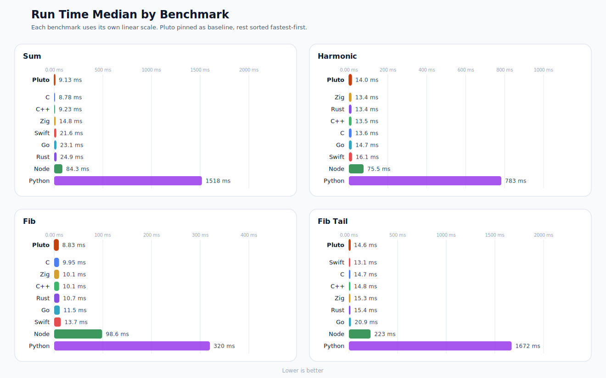
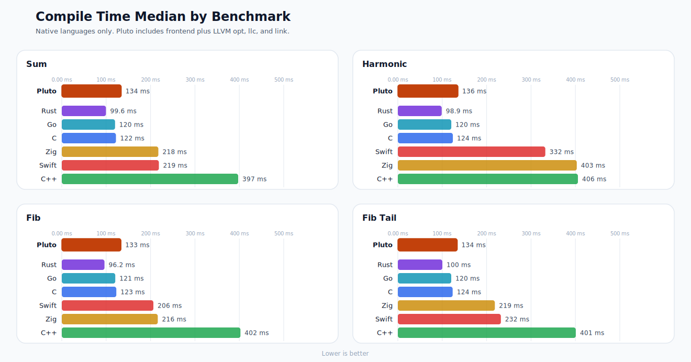

# Pluto Bench

Cross-language benchmarks for Pluto, C, C++, Swift, Go, Rust, Zig, Julia, Node, Bun, and Python.

This repo is separate from the main Pluto compiler repo. It keeps a small set
of equivalent benchmark programs and a single harness that compiles and runs
them in each language, checks output parity, and reports timings.

## Latest Results

Tested on `2026-03-21 12:37:40 IST` with:

- Machine: Apple M1 Pro
- CPU cores: 10
- Memory: 16 GiB
- OS: macOS 26.3.1 (25D2128)
- Command: `python3 scripts/benchmark.py --repeat 10 --snapshot-dir results/latest`
- Benchmark mode: median of 10 samples
- All languages are timed as fresh processes
- Pluto rows are marked as `Pluto (baseline)` for quick comparison

## Visual Summary

Run time overview:



Compile time overview:



The charts are the quick view. The tables below are the exact reference.

### Sum

| Language | Version | Compile ms | Run ms | Output |
|---|---|---:|---:|---|
| **Pluto (baseline)** | `pluto dev` | **95.877** | **21.165** | `160000000` |
| C | `Apple clang 17.0.0` | 65.606 | 18.026 | `160000000` |
| C++ | `Apple clang 17.0.0` | 342.106 | 17.397 | `160000000` |
| Swift | `Swift 6.2.4` | 212.368 | 22.198 | `160000000` |
| Go | `go1.26.1` | 125.355 | 25.256 | `160000000` |
| Rust | `rustc 1.94.0` | 103.881 | 26.419 | `160000000` |
| Zig | `zig 0.15.2` | 212.628 | 20.068 | `160000000` |
| Julia | `Julia 1.12.5` | - | 154.365 | `160000000` |
| Node | `Node v25.8.1` | - | 86.622 | `160000000` |
| Bun | `Bun 1.3.9` | - | 35.288 | `160000000` |
| Python | `Python 3.14.3` | - | 857.014 | `160000000` |

### Fib

| Language | Version | Compile ms | Run ms | Output |
|---|---|---:|---:|---|
| **Pluto (baseline)** | `pluto dev` | **95.062** | **30.008** | `2178309` |
| C | `Apple clang 17.0.0` | 64.530 | 11.451 | `2178309` |
| C++ | `Apple clang 17.0.0` | 338.448 | 12.049 | `2178309` |
| Swift | `Swift 6.2.4` | 196.278 | 15.783 | `2178309` |
| Go | `go1.26.1` | 126.326 | 14.455 | `2178309` |
| Rust | `rustc 1.94.0` | 103.966 | 12.246 | `2178309` |
| Zig | `zig 0.15.2` | 211.268 | 15.362 | `2178309` |
| Julia | `Julia 1.12.5` | - | 152.652 | `2178309` |
| Node | `Node v25.8.1` | - | 89.858 | `2178309` |
| Bun | `Bun 1.3.9` | - | 25.694 | `2178309` |
| Python | `Python 3.14.3` | - | 311.596 | `2178309` |

### Fib Tail

| Language | Version | Compile ms | Run ms | Output |
|---|---|---:|---:|---|
| **Pluto (baseline)** | `pluto dev` | **97.875** | **16.492** | `285144350000` |
| C | `Apple clang 17.0.0` | 65.267 | 4.108 | `285144350000` |
| C++ | `Apple clang 17.0.0` | 346.153 | 4.217 | `285144350000` |
| Swift | `Swift 6.2.4` | 219.302 | 5.628 | `285144350000` |
| Go | `go1.26.1` | 129.213 | 6.141 | `285144350000` |
| Rust | `rustc 1.94.0` | 108.494 | 4.519 | `285144350000` |
| Zig | `zig 0.15.2` | 217.422 | 4.824 | `285144350000` |
| Julia | `Julia 1.12.5` | - | 145.257 | `285144350000` |
| Node | `Node v25.8.1` | - | 80.721 | `285144350000` |
| Bun | `Bun 1.3.9` | - | 21.796 | `285144350000` |
| Python | `Python 3.14.3` | - | 179.989 | `285144350000` |

### Harmonic

| Language | Version | Compile ms | Run ms | Output |
|---|---|---:|---:|---|
| **Pluto (baseline)** | `pluto dev` | **94.717** | **14.844** | `16.695311` |
| C | `Apple clang 17.0.0` | 58.346 | 14.722 | `16.695311` |
| C++ | `Apple clang 17.0.0` | 302.836 | 16.078 | `16.695311` |
| Swift | `Swift 6.2.4` | 296.047 | 17.414 | `16.695311` |
| Go | `go1.26.1` | 122.754 | 16.760 | `16.695311` |
| Rust | `rustc 1.94.0` | 103.461 | 15.048 | `16.695311` |
| Zig | `zig 0.15.2` | 375.019 | 17.299 | `16.695311` |
| Julia | `Julia 1.12.5` | - | 283.289 | `16.695311` |
| Node | `Node v25.8.1` | - | 78.354 | `16.695311` |
| Bun | `Bun 1.3.9` | - | 24.565 | `16.695311` |
| Python | `Python 3.14.3` | - | 465.852 | `16.695311` |

## Benchmarks

- `sum`
  Integer reduction benchmark.
  Sums `(i * 3) % 17` for `i` from `1` to `20,000,000`.
  This avoids closed-form constant folding in native compilers while staying within JavaScript's exact integer range.
  Expected output: `160000000`

- `fib`
  Naive recursive Fibonacci benchmark.
  Computes `fib(32)` with tree recursion to expose recursion, branching, and function-call cost.
  Expected output: `2178309`

- `fib_tail`
  Tail-recursive Fibonacci benchmark.
  Accumulates `100,000` tail-recursive Fibonacci calls, alternating between `fib(32)` and `fib(33)`.
  This makes the runtime less sensitive to process-startup noise than a single `fib(32)` call.
  Expected output: `285144350000`

- `harmonic`
  Floating-point throughput benchmark.
  Computes the harmonic sum from `1` to `10,000,000`.
  Expected output: `16.695311`

Each benchmark directory contains equivalent `main.*` implementations for the
languages included in the suite, plus `expected.txt` and optional Pluto support
files such as `support.pt`.

## Running

Run the full suite:

```sh
python3 scripts/benchmark.py
```

Regenerate the checked-in charts and snapshot:

```sh
python3 scripts/benchmark.py --repeat 10 --snapshot-dir results/latest
```

Run a single benchmark:

```sh
python3 scripts/benchmark.py sum
python3 scripts/benchmark.py fib
python3 scripts/benchmark.py fib_tail
python3 scripts/benchmark.py harmonic
```

By default the harness looks for Pluto at `../pluto/pluto`, which matches:

```text
/Users/tejas/Downloads/bench
/Users/tejas/Downloads/pluto/pluto
```

If your Pluto binary is elsewhere, override it with:

```sh
python3 scripts/benchmark.py --pluto /path/to/pluto
```

or:

```sh
PLUTO_BIN=/path/to/pluto python3 scripts/benchmark.py
```

## Measurement Notes

- Pluto, C, C++, Swift, Go, Rust, and Zig report native compile time and execution time separately.
- Julia, Node, Bun, and Python are reported as runtime or JIT execution only, so their compile column is `-`.
- Pluto currently uses its own LLVM pipeline with `opt -O3`.
- C and C++ are built with `-O3` for consistency with the native comparison.
- Swift is built with `swiftc -O`.
- Rust is built with `rustc -C opt-level=3`.
- Zig is built with `zig build-exe -O ReleaseFast`.
- Go uses the default optimized `go build` pipeline.
- Julia runs with `julia --startup-file=no`.
- The harness creates isolated temp work directories and copies each benchmark into them before running.
- It copies the benchmark files into that directory, including Pluto support `.pt` files when present.
- Every timed sample launches a fresh process, so the published `run_ms` numbers are end-to-end wall-clock timings.
- One warm-up execution runs before each timed sample.
- Short runtime cases such as `sum`, `fib_tail`, and `harmonic` still include non-trivial process-startup noise, so treat small differences there with caution.
- Output is checked against `expected.txt` for the benchmark.
