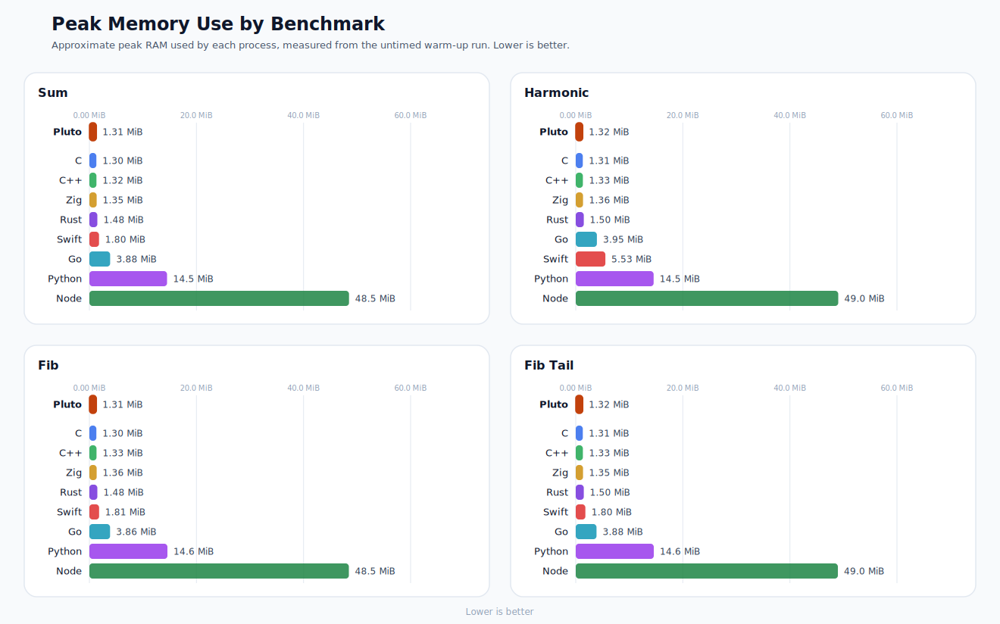
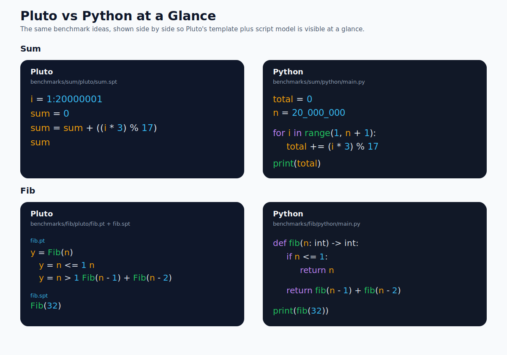

# Pluto Bench

Cross-language benchmarks for Pluto, C, C++, Swift, Go, Rust, Zig, Julia, Node, Bun, and Python.

This repo is separate from the main Pluto compiler repo. It keeps a small set
of equivalent benchmark programs and a single harness that compiles and runs
them in each language, checks output parity, and reports timings.

## Latest Results

Tested on `2026-04-08 22:29:11 UTC+05:30` with:

- Machine: Apple M1 Pro
- CPU cores: 10
- Memory: 16 GiB
- OS: macOS 26.4 (25E246)
- Command: `python3 scripts/benchmark.py --repeat 10 --snapshot-dir results/latest`
- Benchmark mode: median of 10 samples
- All languages are timed as fresh processes
- Pluto rows are marked as `Pluto (baseline)` for quick comparison

## Visual Summary

Run time overview:

<picture>
  <source media="(max-width: 800px)" srcset="results/latest/run-times-mobile.svg" />
  
</picture>

Peak memory overview:

<picture>
  <source media="(max-width: 800px)" srcset="results/latest/peak-rss-mobile.svg" />
  
</picture>

Compile time overview:

<picture>
  <source media="(max-width: 800px)" srcset="results/latest/compile-times-mobile.svg" />
  
</picture>

The charts are the quick view. Each benchmark uses its own linear scale, so bar lengths are comparable within a benchmark but not across benchmarks. The tables below are the exact reference.

## Pluto vs Python at a Glance

<picture>
  <source media="(max-width: 800px)" srcset="assets/pluto-vs-python-mobile.svg" />
  
</picture>

- `sum`: Pluto source is `benchmarks/sum/pluto/main.spt`; Python source is `benchmarks/sum/python/main.py`.
- `fib`: Pluto uses `benchmarks/fib/pluto/fib.pt` plus `benchmarks/fib/pluto/fib.spt`; Python uses `benchmarks/fib/python/main.py`.

## Result Tables

### Sum

| Language | Version | Compile ms | Run ms | Peak Memory | Output |
| --- | --- | ---: | ---: | ---: | --- |
| **Pluto (baseline)** | `pluto dev` | **140.176** | **8.880** | **1.31 MiB** | `160000000` |
| C | `Apple clang 21.0.0` | 62.561 | 8.831 | 1.30 MiB | `160000000` |
| C++ | `Apple clang 21.0.0` | 384.165 | 9.074 | 1.31 MiB | `160000000` |
| Swift | `Swift 6.3` | 226.112 | 20.687 | 1.80 MiB | `160000000` |
| Go | `go1.26.2` | 126.027 | 22.942 | 3.89 MiB | `160000000` |
| Rust | `rustc 1.94.1` | 107.244 | 24.695 | 1.48 MiB | `160000000` |
| Zig | `zig 0.15.2` | 215.675 | 15.337 | 1.36 MiB | `160000000` |
| Node | `Node v25.9.0` | - | 89.828 | 48.62 MiB | `160000000` |
| Python | `Python 3.14.3` | - | 1547.350 | 14.55 MiB | `160000000` |

### Fib

| Language | Version | Compile ms | Run ms | Peak Memory | Output |
| --- | --- | ---: | ---: | ---: | --- |
| **Pluto (baseline)** | `pluto dev` | **140.400** | **9.604** | **1.32 MiB** | `2178309` |
| C | `Apple clang 21.0.0` | 67.903 | 10.221 | 1.31 MiB | `2178309` |
| C++ | `Apple clang 21.0.0` | 387.600 | 10.224 | 1.33 MiB | `2178309` |
| Swift | `Swift 6.3` | 216.635 | 13.733 | 1.81 MiB | `2178309` |
| Go | `go1.26.2` | 128.679 | 12.123 | 3.86 MiB | `2178309` |
| Rust | `rustc 1.94.1` | 102.203 | 10.594 | 1.48 MiB | `2178309` |
| Zig | `zig 0.15.2` | 212.785 | 10.643 | 1.36 MiB | `2178309` |
| Node | `Node v25.9.0` | - | 91.118 | 48.58 MiB | `2178309` |
| Python | `Python 3.14.3` | - | 315.804 | 14.57 MiB | `2178309` |

### Fib Tail

| Language | Version | Compile ms | Run ms | Peak Memory | Output |
| --- | --- | ---: | ---: | ---: | --- |
| **Pluto (baseline)** | `pluto dev` | **142.357** | **14.842** | **1.32 MiB** | `2851443500000` |
| C | `Apple clang 21.0.0` | 63.634 | 14.655 | 1.31 MiB | `2851443500000` |
| C++ | `Apple clang 21.0.0` | 389.261 | 14.962 | 1.33 MiB | `2851443500000` |
| Swift | `Swift 6.3` | 241.862 | 13.007 | 1.80 MiB | `2851443500000` |
| Go | `go1.26.2` | 125.195 | 20.649 | 3.84 MiB | `2851443500000` |
| Rust | `rustc 1.94.1` | 106.508 | 15.115 | 1.50 MiB | `2851443500000` |
| Zig | `zig 0.15.2` | 215.348 | 14.838 | 1.36 MiB | `2851443500000` |
| Node | `Node v25.9.0` | - | 211.396 | 49.02 MiB | `2851443500000` |
| Python | `Python 3.14.3` | - | 1646.925 | 14.55 MiB | `2851443500000` |

### Harmonic

| Language | Version | Compile ms | Run ms | Peak Memory | Output |
| --- | --- | ---: | ---: | ---: | --- |
| **Pluto (baseline)** | `pluto dev` | **141.021** | **13.421** | **1.31 MiB** | `16.695311` |
| C | `Apple clang 21.0.0` | 64.443 | 13.444 | 1.31 MiB | `16.695311` |
| C++ | `Apple clang 21.0.0` | 393.279 | 13.468 | 1.33 MiB | `16.695311` |
| Swift | `Swift 6.3` | 347.975 | 15.699 | 5.55 MiB | `16.695311` |
| Go | `go1.26.2` | 127.601 | 14.415 | 3.90 MiB | `16.695311` |
| Rust | `rustc 1.94.1` | 108.032 | 13.694 | 1.50 MiB | `16.695311` |
| Zig | `zig 0.15.2` | 381.676 | 13.751 | 1.34 MiB | `16.695311` |
| Node | `Node v25.9.0` | - | 79.452 | 49.16 MiB | `16.695311` |
| Python | `Python 3.14.3` | - | 786.627 | 14.59 MiB | `16.695311` |

## Benchmarks

- `sum`
  Integer reduction benchmark.
  Sums `(i * 3) % 17` for `i` from `1` to `20,000,000`.
  This avoids closed-form constant folding in native compilers while staying within JavaScript's exact integer range.
  Expected output: `160000000`

- `fib`
  Naive recursive Fibonacci benchmark.
  Computes `fib(32)` with tree recursion to expose recursion, branching, and function-call cost.
  Expected output: `2178309`

- `fib_tail`
  Tail-recursive Fibonacci benchmark.
  Accumulates `1,000,000` tail-recursive Fibonacci calls, alternating between `fib(32)` and `fib(33)`.
  This makes the runtime less sensitive to process-startup noise than a single `fib(32)` call.
  Expected output: `2851443500000`

- `harmonic`
  Floating-point throughput benchmark.
  Computes the harmonic sum from `1` to `10,000,000`.
  Expected output: `16.695311`

Each benchmark directory keeps `expected.txt` at the case root and places each
language implementation under its own subdirectory, for example
`benchmarks/sum/go/main.go` or `benchmarks/fib/pluto/fib.spt`. Pluto-specific
template files such as `fib.pt` live alongside the Pluto script in that
benchmark's `pluto/` subdirectory.

## Running

Run the full suite:

```sh
python3 scripts/benchmark.py
```

The harness is compatible with Python 3.9+.

GitHub Actions also runs the suite on `ubuntu-24.04`. That workflow checks out
`pluto`, builds it with LLVM 21, runs the same harness, and uploads a separate
snapshot artifact under `results/linux-gha` semantics. It does not overwrite the
checked-in `results/latest` macOS snapshot.

Regenerate the checked-in charts and snapshot:

```sh
python3 scripts/benchmark.py --repeat 10 --snapshot-dir results/latest
```

Run a single benchmark:

```sh
python3 scripts/benchmark.py sum
python3 scripts/benchmark.py fib
python3 scripts/benchmark.py fib_tail
python3 scripts/benchmark.py harmonic
```

By default the harness looks for Pluto at `../pluto/pluto`, which matches:

```text
/Users/tejas/Downloads/bench
/Users/tejas/Downloads/pluto/pluto
```

If your Pluto binary is elsewhere, override it with:

```sh
python3 scripts/benchmark.py --pluto /path/to/pluto
```

or:

```sh
PLUTO_BIN=/path/to/pluto python3 scripts/benchmark.py
```

## Measurement Notes

- Pluto, C, C++, Swift, Go, Rust, and Zig report native compile time and execution time separately.
- Julia, Node, Bun, and Python are reported as runtime or JIT execution only, so their compile column is `-`.
- Snapshot tables only include languages whose toolchains were available on the host where the snapshot was generated.
- Peak Memory is collected automatically when the host supports `/usr/bin/time`.
- Peak Memory is the median peak resident set size (RSS) across the untimed warm-up runs.
- In plain terms, think of Peak Memory as the approximate RAM used by the benchmark process at its peak.
- Pluto currently uses its own LLVM pipeline with `opt -O3`.
- C and C++ are built with `-O3` for consistency with the native comparison.
- Swift is built with `swiftc -O`.
- Rust is built with `rustc -C opt-level=3`.
- Zig is built with `zig build-exe -O ReleaseFast` and a baseline CPU target
  for fairer comparison with the other native compilers.
- Go uses the default optimized `go build` pipeline.
- Julia runs with `julia --startup-file=no`.
- The harness creates isolated temp work directories and copies each benchmark into them before running.
- It copies the benchmark files into that directory, including Pluto support `.pt` files when present.
- Every timed sample launches a fresh process, so the published `run_ms` numbers are end-to-end wall-clock timings.
- One warm-up execution runs before each timed sample.
- Short runtime cases such as `sum` and `harmonic` still include non-trivial process-startup noise, so treat small differences there with caution.
- Output is checked against `expected.txt` for the benchmark.
