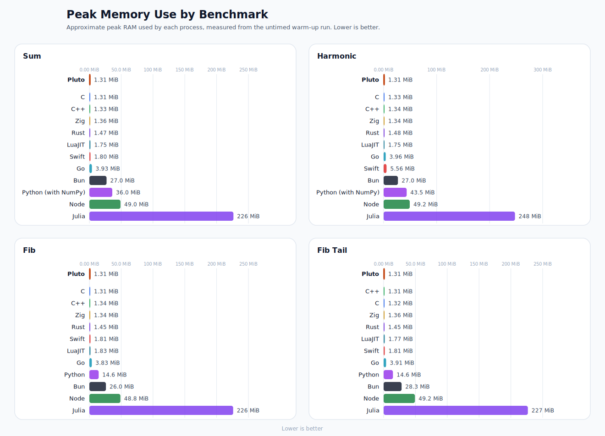

# Pluto Bench

Cross-language benchmarks for Pluto, C, C++, Swift, Go, Rust, Zig, Julia, LuaJIT, Node, Bun, and Python.
The Python `sum` and `harmonic` cases use NumPy-backed implementations; the
recursive `fib` and `fib_tail` cases stay plain Python.

This repo is separate from the main Pluto compiler repo. It keeps a small set
of equivalent benchmark programs and a single harness that compiles and runs
them in each language, checks output parity, and reports timings.

## Latest Results

Tested on `2026-05-03 22:31:24 UTC+04:00` with:

- Machine: Apple M1 Pro
- CPU cores: 10
- Memory: 16 GiB
- OS: macOS 26.4.1 (25E253)
- Command: `python3 scripts/benchmark.py --repeat 10 --warmup-runs 5 --snapshot-dir results/latest`
- Pluto LLVM: in-process LLVM 22.1.4
- Pluto linker: `/usr/bin/clang` (`Apple clang 21.0.0`)
- C/C++ compilers: `/usr/bin/clang`, `/usr/bin/clang++` (`Apple clang 21.0.0`)
- Benchmark mode: median of 10 samples, 5 warm-up executions per sample
- All languages are timed as fresh processes
- Compiled languages use host-native CPU tuning where the toolchain exposes it
- Pluto rows are bolded for quick comparison

## Visual Summary

Run time overview:

<picture>
  <source media="(max-width: 800px)" srcset="results/latest/run-times-mobile.svg" />
  
</picture>

Peak memory overview:

<picture>
  <source media="(max-width: 800px)" srcset="results/latest/peak-memory-mobile.svg" />
  
</picture>

Compile time overview:

<picture>
  <source media="(max-width: 800px)" srcset="results/latest/compile-times-mobile.svg" />
  
</picture>

## Pluto vs Python at a Glance

<picture>
  <source media="(max-width: 800px)" srcset="assets/pluto-vs-python-mobile.svg" />
  
</picture>

- `sum`: Pluto source is `benchmarks/sum/pluto/sum.spt`; Python source is `benchmarks/sum/python/main.py` and uses NumPy.
- `fib`: Pluto uses `benchmarks/fib/pluto/fib.pt` plus `benchmarks/fib/pluto/fib.spt`; Python uses `benchmarks/fib/python/main.py`.

## Result Tables

### Sum

| Language | Version | Compile ms | Run ms | Peak Memory | Output |
| --- | --- | ---: | ---: | ---: | --- |
| **Pluto** | `pluto dev` | **62.837** | **8.908** | **1.3 MiB** | `160000000` |
| C | `Apple clang 21.0.0` | 55.870 | 8.925 | 1.3 MiB | `160000000` |
| C++ | `Apple clang 21.0.0` | 58.086 | 8.940 | 1.3 MiB | `160000000` |
| Swift | `Swift 6.3.1` | 203.287 | 18.857 | 1.8 MiB | `160000000` |
| Go | `go1.26.2` | 113.538 | 20.873 | 4.0 MiB | `160000000` |
| Rust | `rustc 1.95.0` | 87.689 | 22.685 | 1.5 MiB | `160000000` |
| Zig | `zig 0.15.2` | 204.523 | 13.687 | 1.4 MiB | `160000000` |
| Julia | `Julia 1.12.5` | - | 136.174 | 226 MiB | `160000000` |
| LuaJIT | `LuaJIT 2.1.1774896198` | - | 39.146 | 1.8 MiB | `160000000` |
| Node | `Node v25.9.0` | - | 82.737 | 48.8 MiB | `160000000` |
| Bun | `Bun 1.3.9` | - | 31.695 | 27.0 MiB | `160000000` |
| Python | `Python 3.14.4 + NumPy 2.4.4` | - | 122.332 | 35.9 MiB | `160000000` |

### Fib

| Language | Version | Compile ms | Run ms | Peak Memory | Output |
| --- | --- | ---: | ---: | ---: | --- |
| **Pluto** | `pluto dev` | **61.606** | **9.291** | **1.3 MiB** | `2178309` |
| C | `Apple clang 21.0.0` | 53.986 | 9.692 | 1.3 MiB | `2178309` |
| C++ | `Apple clang 21.0.0` | 55.274 | 9.682 | 1.3 MiB | `2178309` |
| Swift | `Swift 6.3.1` | 188.262 | 11.991 | 1.8 MiB | `2178309` |
| Go | `go1.26.2` | 114.106 | 10.964 | 3.9 MiB | `2178309` |
| Rust | `rustc 1.95.0` | 86.185 | 10.076 | 1.5 MiB | `2178309` |
| Zig | `zig 0.15.2` | 208.690 | 10.363 | 1.3 MiB | `2178309` |
| Julia | `Julia 1.12.5` | - | 145.900 | 226 MiB | `2178309` |
| LuaJIT | `LuaJIT 2.1.1774896198` | - | 16.806 | 1.8 MiB | `2178309` |
| Node | `Node v25.9.0` | - | 90.315 | 48.8 MiB | `2178309` |
| Bun | `Bun 1.3.9` | - | 25.104 | 26.1 MiB | `2178309` |
| Python | `Python 3.14.4` | - | 265.558 | 14.6 MiB | `2178309` |

### Fib Tail

| Language | Version | Compile ms | Run ms | Peak Memory | Output |
| --- | --- | ---: | ---: | ---: | --- |
| **Pluto** | `pluto dev` | **71.589** | **8.020** | **1.3 MiB** | `2851443500000` |
| C | `Apple clang 21.0.0` | 60.658 | 14.749 | 1.3 MiB | `2851443500000` |
| C++ | `Apple clang 21.0.0` | 62.415 | 14.542 | 1.3 MiB | `2851443500000` |
| Swift | `Swift 6.3.1` | 235.030 | 12.270 | 1.8 MiB | `2851443500000` |
| Go | `go1.26.2` | 115.720 | 19.853 | 3.8 MiB | `2851443500000` |
| Rust | `rustc 1.95.0` | 102.205 | 14.884 | 1.5 MiB | `2851443500000` |
| Zig | `zig 0.15.2` | 215.911 | 14.771 | 1.4 MiB | `2851443500000` |
| Julia | `Julia 1.12.5` | - | 163.713 | 227 MiB | `2851443500000` |
| LuaJIT | `LuaJIT 2.1.1774896198` | - | 24.034 | 1.8 MiB | `2851443500000` |
| Node | `Node v25.9.0` | - | 208.553 | 49.2 MiB | `2851443500000` |
| Bun | `Bun 1.3.9` | - | 33.715 | 28.3 MiB | `2851443500000` |
| Python | `Python 3.14.4` | - | 1197.064 | 14.6 MiB | `2851443500000` |

### Harmonic

| Language | Version | Compile ms | Run ms | Peak Memory | Output |
| --- | --- | ---: | ---: | ---: | --- |
| **Pluto** | `pluto dev` | **68.675** | **13.370** | **1.3 MiB** | `16.695311` |
| C | `Apple clang 21.0.0` | 62.389 | 13.600 | 1.3 MiB | `16.695311` |
| C++ | `Apple clang 21.0.0` | 63.969 | 13.279 | 1.3 MiB | `16.695311` |
| Swift | `Swift 6.3.1` | 341.454 | 15.224 | 5.6 MiB | `16.695311` |
| Go | `go1.26.2` | 125.248 | 14.318 | 3.9 MiB | `16.695311` |
| Rust | `rustc 1.95.0` | 101.001 | 13.653 | 1.5 MiB | `16.695311` |
| Zig | `zig 0.15.2` | 417.292 | 13.499 | 1.4 MiB | `16.695311` |
| Julia | `Julia 1.12.5` | - | 256.196 | 248 MiB | `16.695311` |
| LuaJIT | `LuaJIT 2.1.1774896198` | - | 13.813 | 1.8 MiB | `16.695311` |
| Node | `Node v25.9.0` | - | 80.444 | 49.4 MiB | `16.695311` |
| Bun | `Bun 1.3.9` | - | 24.909 | 27.0 MiB | `16.695311` |
| Python | `Python 3.14.4 + NumPy 2.4.4` | - | 85.673 | 43.7 MiB | `16.695311` |

## Benchmarks

- `sum`
  Integer reduction benchmark.
  Sums `(i * 3) % 17` for `i` from `1` to `20,000,000`.
  This avoids closed-form constant folding in native compilers while staying within JavaScript's exact integer range.
  Expected output: `160000000`

- `fib`
  Naive recursive Fibonacci benchmark.
  Computes `fib(32)` with tree recursion to expose recursion, branching, and function-call cost.
  Expected output: `2178309`

- `fib_tail`
  Tail-recursive Fibonacci benchmark.
  Accumulates `1,000,000` tail-recursive Fibonacci calls, alternating between `fib(32)` and `fib(33)`.
  This makes the runtime less sensitive to process-startup noise than a single `fib(32)` call.
  Expected output: `2851443500000`

- `harmonic`
  Floating-point throughput benchmark.
  Computes the harmonic sum from `1` to `10,000,000`.
  Expected output: `16.695311`

Each benchmark directory keeps `expected.txt` at the case root and places each
language implementation under its own subdirectory, for example
`benchmarks/sum/go/main.go` or `benchmarks/fib/pluto/fib.spt`. Pluto-specific
template files such as `fib.pt` live alongside the Pluto script in that
benchmark's `pluto/` subdirectory.

## Running

Run the full suite:

```sh
python3 scripts/benchmark.py
```

Regenerate the checked-in charts and snapshot:

```sh
python3 scripts/benchmark.py --repeat 10 --warmup-runs 5 --snapshot-dir results/latest
```

The harness is compatible with Python 3.9+.

GitHub Actions also runs the suite on `ubuntu-24.04`. That workflow checks out
`pluto`, builds it with Pluto's `build.py` on LLVM 22, runs the same harness,
and uploads a separate snapshot artifact under `results/linux-gha` semantics.
It does not overwrite the checked-in `results/latest` macOS snapshot.

Run a single benchmark:

```sh
python3 scripts/benchmark.py sum
python3 scripts/benchmark.py fib
python3 scripts/benchmark.py fib_tail
python3 scripts/benchmark.py harmonic
```

Override tool locations when needed with `--pluto`, `--zig`, `--cc`, `--cxx`,
and `--luajit` or the matching environment variables `PLUTO_BIN`, `ZIG_BIN`,
`CC_BIN`, `CXX_BIN`, and `LUAJIT_BIN`.

```sh
python3 scripts/benchmark.py \
  --pluto /path/to/pluto \
  --zig /path/to/zig \
  --cc /path/to/clang \
  --cxx /path/to/clang++ \
  --luajit /path/to/luajit
```

Use `--warmup-runs N` to control the number of untimed executions before each
timed sample. The default is `5`, which avoids post-link first-run artifacts on
freshly built binaries.

## Measurement Notes

- Pluto, C, C++, Swift, Go, Rust, and Zig report native compile time and execution time separately.
- Julia, LuaJIT, Node, Bun, and Python are reported as runtime or JIT execution only, so their compile column is `-`.
- Python uses NumPy-backed implementations for `sum` and `harmonic`, and plain Python for `fib` and `fib_tail`.
- Snapshot tables only include languages whose toolchains were available on the host where the snapshot was generated.
- Peak Memory is collected automatically when the host supports `/usr/bin/time`; it is the median peak resident set size from the first warm-up execution in each sample.
- Pluto uses its in-process LLVM `default<O3>` pipeline to optimize IR and emit native objects, then
  links executables through `clang`; benchmark metadata records both separately.
- On macOS, the harness defaults to Apple clang for C/C++ and aligns Pluto's link-driver `PATH`
  to the selected C compiler directory.
- Pluto is compiled with `PLUTO_TARGET_CPU=native`.
- For dev builds, rebuild the Pluto binary immediately before benchmarking; the metadata records
  the selected binary path and containing repo, but the dev binary does not embed its source commit.
- Compiled languages use their standard optimized modes plus host-native CPU tuning where supported.
- C and C++ use `-O3`, Swift uses `-O`, Rust uses `-C opt-level=3`, and Zig uses `-O ReleaseFast`.
- Julia runs with `julia --startup-file=no`.
- LuaJIT runs with `luajit`.
- The harness creates isolated temp work directories, copies benchmark files into them, and launches a fresh process for every timed sample.
- Five warm-up executions run before each timed sample by default.
- Short runtime cases such as `sum` and `harmonic` still include non-trivial process-startup noise, so treat small differences there with caution.
- Output is checked against `expected.txt` for the benchmark.
