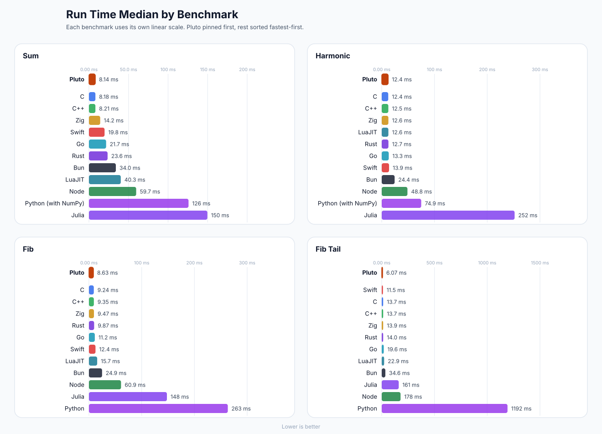
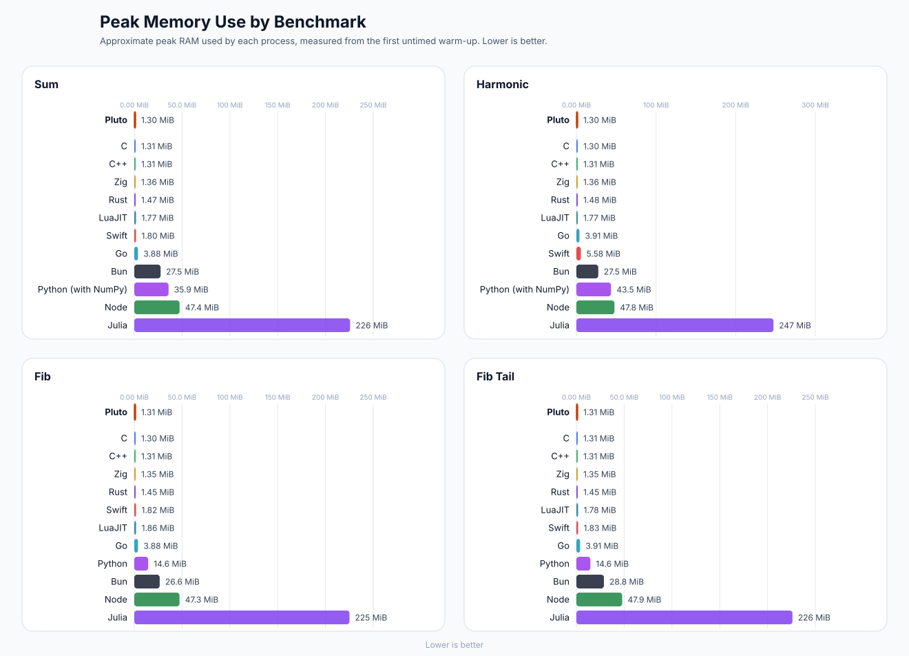
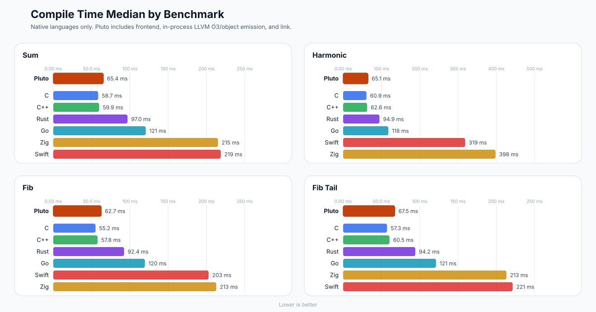
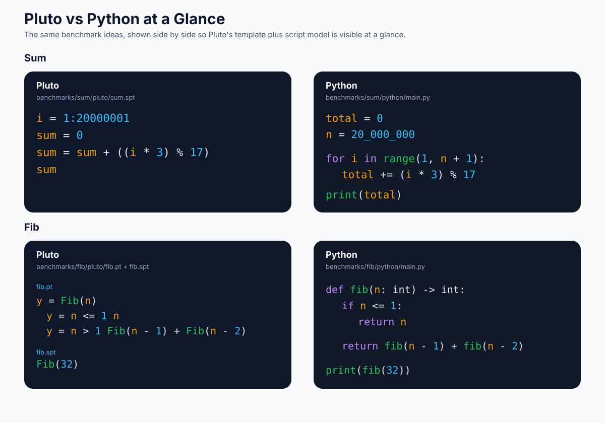

# Pluto Bench

Cross-language benchmarks for Pluto, C, C++, Swift, Go, Rust, Zig, Julia, LuaJIT, Node, Bun, and Python.
The Python `sum` and `harmonic` cases use NumPy-backed implementations; the
recursive `fib` and `fib_tail` cases stay plain Python.

This repo is separate from the main Pluto compiler repo. It keeps a small set
of equivalent benchmark programs and a single harness that compiles and runs
them in each language, checks output parity, and reports timings.

## Latest Results

Tested on `2026-07-23 14:59:58 UTC+05:30` with:

- Machine: Apple M1 Pro
- CPU cores: 10
- Memory: 16 GiB
- OS: macOS 26.5.2
- Command: `python3 scripts/benchmark.py --repeat 10 --warmup-runs 5 --snapshot-dir results/latest`
- Pluto LLVM: in-process LLVM 22.1.8
- Pluto linker: `clang` (`Apple clang 21.0.0 (clang-2100.1.1.101)`)
- C/C++ compilers: `Apple clang 21.0.0`
- Benchmark mode: median of 10 samples, 5 warm-up executions per sample
- All languages are timed as fresh processes
- Compiled languages use host-native CPU tuning where the toolchain exposes it
- Pluto rows are bolded for quick comparison

## Visual Summary

Run time overview:

<picture>
  <source media="(max-width: 800px)" srcset="results/latest/run-times-mobile.svg" />
  
</picture>

Peak memory overview:

<picture>
  <source media="(max-width: 800px)" srcset="results/latest/peak-memory-mobile.svg" />
  
</picture>

Compile time overview:

<picture>
  <source media="(max-width: 800px)" srcset="results/latest/compile-times-mobile.svg" />
  
</picture>

## Pluto vs Python at a Glance

<picture>
  <source media="(max-width: 800px)" srcset="assets/pluto-vs-python-mobile.svg" />
  
</picture>

- `sum`: Pluto source is `benchmarks/sum/pluto/sum.spt`; Python source is `benchmarks/sum/python/main.py` and uses NumPy.
- `fib`: Pluto uses `benchmarks/fib/pluto/fib.pt` plus `benchmarks/fib/pluto/fib.spt`; Python uses `benchmarks/fib/python/main.py`.

## Result Tables

### Sum

| Language | Version | Compile ms | Run ms | Peak Memory | Output |
| --- | --- | ---: | ---: | ---: | --- |
| **Pluto** | `pluto dev` | **65.429** | **8.141** | **1.30 MiB** | `160000000` |
| C | `Apple clang 21.0.0` | 58.664 | 8.185 | 1.31 MiB | `160000000` |
| C++ | `Apple clang 21.0.0` | 59.902 | 8.209 | 1.31 MiB | `160000000` |
| Swift | `Swift 6.3.3` | 218.685 | 19.750 | 1.80 MiB | `160000000` |
| Go | `go1.26.5` | 120.751 | 21.720 | 3.88 MiB | `160000000` |
| Rust | `rustc 1.97.1` | 96.981 | 23.565 | 1.47 MiB | `160000000` |
| Zig | `zig 0.15.2` | 215.120 | 14.248 | 1.36 MiB | `160000000` |
| Julia | `Julia 1.12.6` | - | 149.676 | 226 MiB | `160000000` |
| LuaJIT | `LuaJIT 2.1.1784580905` | - | 40.256 | 1.77 MiB | `160000000` |
| Node | `Node v26.5.0` | - | 59.720 | 47.4 MiB | `160000000` |
| Bun | `Bun 1.3.9` | - | 34.023 | 27.5 MiB | `160000000` |
| Python | `Python 3.14.6 + NumPy 2.5.1` | - | 125.902 | 35.9 MiB | `160000000` |

### Fib

| Language | Version | Compile ms | Run ms | Peak Memory | Output |
| --- | --- | ---: | ---: | ---: | --- |
| **Pluto** | `pluto dev` | **62.666** | **8.634** | **1.31 MiB** | `2178309` |
| C | `Apple clang 21.0.0` | 55.173 | 9.243 | 1.30 MiB | `2178309` |
| C++ | `Apple clang 21.0.0` | 57.825 | 9.348 | 1.31 MiB | `2178309` |
| Swift | `Swift 6.3.3` | 202.809 | 12.430 | 1.82 MiB | `2178309` |
| Go | `go1.26.5` | 119.625 | 11.152 | 3.88 MiB | `2178309` |
| Rust | `rustc 1.97.1` | 92.450 | 9.874 | 1.45 MiB | `2178309` |
| Zig | `zig 0.15.2` | 212.772 | 9.467 | 1.35 MiB | `2178309` |
| Julia | `Julia 1.12.6` | - | 147.867 | 225 MiB | `2178309` |
| LuaJIT | `LuaJIT 2.1.1784580905` | - | 15.657 | 1.86 MiB | `2178309` |
| Node | `Node v26.5.0` | - | 60.884 | 47.3 MiB | `2178309` |
| Bun | `Bun 1.3.9` | - | 24.931 | 26.6 MiB | `2178309` |
| Python | `Python 3.14.6` | - | 263.270 | 14.6 MiB | `2178309` |

### Fib Tail

| Language | Version | Compile ms | Run ms | Peak Memory | Output |
| --- | --- | ---: | ---: | ---: | --- |
| **Pluto** | `pluto dev` | **67.462** | **6.073** | **1.31 MiB** | `2851443500000` |
| C | `Apple clang 21.0.0` | 57.287 | 13.681 | 1.31 MiB | `2851443500000` |
| C++ | `Apple clang 21.0.0` | 60.539 | 13.724 | 1.31 MiB | `2851443500000` |
| Swift | `Swift 6.3.3` | 221.407 | 11.480 | 1.83 MiB | `2851443500000` |
| Go | `go1.26.5` | 121.287 | 19.569 | 3.91 MiB | `2851443500000` |
| Rust | `rustc 1.97.1` | 94.202 | 14.039 | 1.45 MiB | `2851443500000` |
| Zig | `zig 0.15.2` | 213.249 | 13.903 | 1.35 MiB | `2851443500000` |
| Julia | `Julia 1.12.6` | - | 161.070 | 226 MiB | `2851443500000` |
| LuaJIT | `LuaJIT 2.1.1784580905` | - | 22.898 | 1.78 MiB | `2851443500000` |
| Node | `Node v26.5.0` | - | 178.499 | 47.9 MiB | `2851443500000` |
| Bun | `Bun 1.3.9` | - | 34.587 | 28.8 MiB | `2851443500000` |
| Python | `Python 3.14.6` | - | 1192.132 | 14.6 MiB | `2851443500000` |

### Harmonic

| Language | Version | Compile ms | Run ms | Peak Memory | Output |
| --- | --- | ---: | ---: | ---: | --- |
| **Pluto** | `pluto dev` | **65.061** | **12.367** | **1.30 MiB** | `16.695311` |
| C | `Apple clang 21.0.0` | 60.878 | 12.365 | 1.30 MiB | `16.695311` |
| C++ | `Apple clang 21.0.0` | 62.634 | 12.502 | 1.31 MiB | `16.695311` |
| Swift | `Swift 6.3.3` | 318.768 | 13.909 | 5.58 MiB | `16.695311` |
| Go | `go1.26.5` | 118.091 | 13.312 | 3.91 MiB | `16.695311` |
| Rust | `rustc 1.97.1` | 94.943 | 12.744 | 1.48 MiB | `16.695311` |
| Zig | `zig 0.15.2` | 398.086 | 12.582 | 1.36 MiB | `16.695311` |
| Julia | `Julia 1.12.6` | - | 251.902 | 247 MiB | `16.695311` |
| LuaJIT | `LuaJIT 2.1.1784580905` | - | 12.586 | 1.77 MiB | `16.695311` |
| Node | `Node v26.5.0` | - | 48.752 | 47.8 MiB | `16.695311` |
| Bun | `Bun 1.3.9` | - | 24.435 | 27.5 MiB | `16.695311` |
| Python | `Python 3.14.6 + NumPy 2.5.1` | - | 74.896 | 43.5 MiB | `16.695311` |

## Benchmarks

- `sum`
  Integer reduction benchmark.
  Sums `(i * 3) % 17` for `i` from `1` to `20,000,000`.
  This avoids closed-form constant folding in native compilers while staying within JavaScript's exact integer range.
  Expected output: `160000000`

- `fib`
  Naive recursive Fibonacci benchmark.
  Computes `fib(32)` with tree recursion to expose recursion, branching, and function-call cost.
  Expected output: `2178309`

- `fib_tail`
  Tail-recursive Fibonacci benchmark.
  Accumulates `1,000,000` tail-recursive Fibonacci calls, alternating between `fib(32)` and `fib(33)`.
  This makes the runtime less sensitive to process-startup noise than a single `fib(32)` call.
  Expected output: `2851443500000`

- `harmonic`
  Floating-point throughput benchmark.
  Computes the harmonic sum from `1` to `10,000,000`.
  Expected output: `16.695311`

Each benchmark directory keeps `expected.txt` at the case root and places each
language implementation under its own subdirectory, for example
`benchmarks/sum/go/main.go` or `benchmarks/fib/pluto/fib.spt`. Pluto-specific
template files such as `fib.pt` live alongside the Pluto script in that
benchmark's `pluto/` subdirectory.

## Running

Run the full suite:

```sh
python3 scripts/benchmark.py
```

Regenerate the checked-in charts and snapshot:

```sh
python3 scripts/benchmark.py --repeat 10 --warmup-runs 5 --snapshot-dir results/latest
```

Re-render the charts from a snapshot that already exists, without re-running
anything (useful after changing chart code, and it needs no language
toolchains installed):

```sh
python3 scripts/benchmark.py --render-only --snapshot-dir results/latest
```

The harness is compatible with Python 3.9+.

GitHub Actions also runs the suite on `ubuntu-24.04`. That workflow checks out
`pluto`, builds it with Pluto's `build.py` on LLVM 22, runs the same harness,
and uploads a separate snapshot artifact under `results/linux-gha` semantics.
It does not overwrite the checked-in `results/latest` macOS snapshot.

Run a single benchmark:

```sh
python3 scripts/benchmark.py sum
python3 scripts/benchmark.py fib
python3 scripts/benchmark.py fib_tail
python3 scripts/benchmark.py harmonic
```

Override tool locations when needed with `--pluto`, `--zig`, `--cc`, `--cxx`,
and `--luajit` or the matching environment variables `PLUTO_BIN`, `ZIG_BIN`,
`CC_BIN`, `CXX_BIN`, and `LUAJIT_BIN`.

```sh
python3 scripts/benchmark.py \
  --pluto /path/to/pluto \
  --zig /path/to/zig \
  --cc /path/to/clang \
  --cxx /path/to/clang++ \
  --luajit /path/to/luajit
```

Use `--warmup-runs N` to control the number of untimed executions before each
timed sample. The default is `5`, which avoids post-link first-run artifacts on
freshly built binaries.

## Measurement Notes

- Pluto, C, C++, Swift, Go, Rust, and Zig report native compile time and execution time separately.
- Julia, LuaJIT, Node, Bun, and Python are reported as runtime or JIT execution only, so their compile column is `-`.
- Python uses NumPy-backed implementations for `sum` and `harmonic`, and plain Python for `fib` and `fib_tail`.
- Snapshot tables only include languages whose toolchains were available on the host where the snapshot was generated.
- Peak Memory is collected automatically when the host supports `/usr/bin/time`; it is the median peak resident set size from the first warm-up execution in each sample.
- Pluto uses its in-process LLVM `default<O3>` pipeline to optimize IR and emit native objects, then
  links executables through `clang`; benchmark metadata records both separately.
- On macOS, the harness defaults to Apple clang for C/C++ and aligns Pluto's link-driver `PATH`
  to the selected C compiler directory.
- Pluto is compiled with `PLUTO_TARGET_CPU=native`.
- For dev builds, rebuild the Pluto binary immediately before benchmarking; the metadata records
  the selected binary path and containing repo, but the dev binary does not embed its source commit.
- Compiled languages use their standard optimized modes plus host-native CPU tuning where supported.
- C and C++ use `-O3`, Swift uses `-O`, Rust uses `-C opt-level=3`, and Zig uses `-O ReleaseFast`.
- Julia runs with `julia --startup-file=no`.
- LuaJIT runs with `luajit`.
- The harness creates isolated temp work directories, copies benchmark files into them, and launches a fresh process for every timed sample.
- Five warm-up executions run before each timed sample by default.
- Short runtime cases such as `sum` and `harmonic` still include non-trivial process-startup noise, so treat small differences there with caution.
- Output is checked against `expected.txt` for the benchmark.
